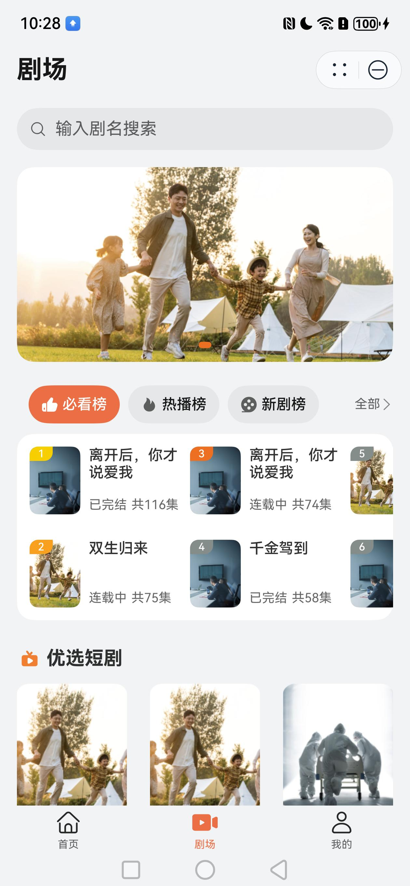
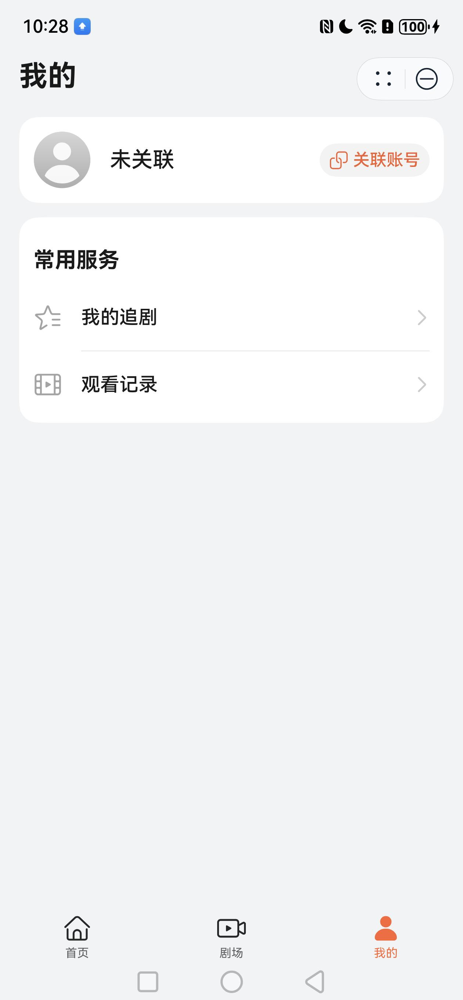
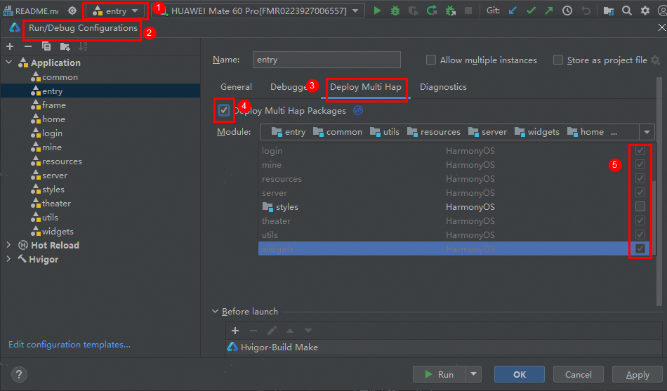

# 网络短剧行业模板快速入门

## 目录

- [网络短剧行业模板快速入门](#网络短剧行业模板快速入门)
  - [目录](#目录)
  - [功能介绍](#功能介绍)
  - [组件](#组件)
  - [环境要求](#环境要求)
    - [软件](#软件)
    - [硬件](#硬件)
  - [快速入门](#快速入门)
    - [配置工程](#配置工程)
    - [运行调试工程](#运行调试工程)
  - [示例效果](#示例效果)
  - [权限要求](#权限要求)
  - [开源许可协议](#开源许可协议)

## 功能介绍

本模板为短剧类元服务提供了常用功能的开发样例，模板主要分首页、剧场、我的及详情播放页三大模块：

* 首页：提供短剧推荐流功能，按照剧目播放。

* 剧场：提供榜单和优选短剧浏览，支持输入剧名搜索。

* 我的：支持账号的管理和常用服务(追剧/观看记录)。

* 详情: 沉浸式观看短剧，支持剧集播放常用功能(上下滑切换剧集，选集，社交交互等)

本模板已集成华为账号等服务，只需做少量配置和定制即可快速实现华为账号的登录功能。

| 首页                         | 剧场                         | 我的                         | 详情                         |
|----------------------------|----------------------------|----------------------------|----------------------------|
|  |  |  |  |

本模板主要页面及核心功能如下所示：

```ts
短剧模板
 |-- 首页
 |    |-- 简介
 |    |-- 看全集
 |    └-- 自动播放全集
 |-- 剧场
 |    └-- 榜单
 |    |-- 优选短剧
 |    └-- 搜索
 |         └-- 历史记录
 └-- 我的
 |    |-- 用户信息
 |    |-- 我的追剧
 |    └-- 观看记录
 └-- 详情
 |    |-- 简介
 |    |-- 社交信息
 |    |    |-- 点赞
 |    |    |-- 分享(示意)
 |    |    |-- 收藏
 |    |    └-- 评论
 |    |-- 选集
 |    |-- 播放设置
 |    └-- 剧集详情介绍
```

本模板工程代码结构如下所示：

```ts
WebShortDrama
  └- commons                                       // 公共层
  |   |- common                                    // 资源统一管理层
  |   |- server/src/main/ets                       // 无法层
  |   |    |- api                                  // 接口层 
  |   |    |    mock                               // 模拟数据
  |   |    |    Decorators.ts                      // 装饰器
  |   |    |    Domain.ts                          // 域名管理
  |   |    |    RequestAPI.ts                      // 请求API定义
  |   |    |- bean                                 // 后端数据结构定义
  |   |    └- handler                              // 请求handler 
  |   |- styles                                    // 风格统一管理层
  |   |- utils                                     // 工具类层
  |   └- widgets                                   // 基础控件类层
  |
  |- components                                    // 组件       
  |   └- video_swiper                              // 滑动视频组件  
  |
  |- EntryCard                                     // 卡片资源     
  |                      
  |- features    
  |   |- home/src/main/ets                          // home主页组合(hsp)
  |   |        |- components                        // 抽离组件   
  |   |        |- mapper                            // 接口数据到页面数据类型映射 
  |   |        |- pages                               
  |   |        |    HomeMainPage.ets                // 主页页面
  |   |        └- viewmodel                         // 与页面一一对应的vm层 
  |   | 
  |   |- detail/src/main/ets                        // 详情播放功能(hsp)
  |   |        |- components                        // 抽离组件   
  |   |        |- mapper                            // 接口数据到页面数据类型映射 
  |   |        |- models                            // class类型定义     
  |   |        |- page                                
  |   |        |    ShortDramaDetailPage.ets        // 详情播放页面
  |   |        |- viewdata                          // view组件的数据定义   
  |   |        └- viewmodels                        // 与页面一一对应的vm层 
  |   | 
  |   |- mine/src/main/ets                          // 我的组合(hsp)
  |   |        |- component                         // 抽离组件   
  |   |        └- pages                               
  |   |             ChangePage.ets                  // 信息修改播放页面
  |   |             MineMainPage.ets                // 我的主页页面
  |   |             MyFavoritesPage.ets             // 我的收藏页面
  |   |             PersonalInfoPage.ets            // 个人信息页面
  |   |             WatchRecordsPage.ets            // 观看记录页面
  |   | 
  |   |- theater/src/main/ets                       // 剧场组合(hsp)
  |   |        |- components                        // 抽离组件   
  |   |        |- mapper                            // 接口数据到页面数据类型映射 
  |   |        |- pages                               
  |   |        |    BillboardPage.ets                // 排行榜页面
  |   |        |    DramaDetailInfoPage.ets          // 剧集详情信息页面
  |   |        |    SearchPage.ets                   // 搜索页面
  |   |        |    TheaterMainPage.ets              // 剧场入口页面  
  |   |        └- viewmodels                         // 与页面一一对应的vm层 
  |   | 
  |   |- frame/src/main/ets/view                    // 通用Frame框架(hsp)
  |   |        |- components                        // 抽离组件   
  |   |        └- pages                               
  |   |             MainTabPage.ets                 // 主页Tab容器页面
  |   | 
  |   └- login                                      // 通用登录功能(hsp)
  |   
  └- products/entry                                 // 应用层主包(hap)  
      └-  src/main/ets                                               
           |- entryability                          // Ability入口页面                                       
           |- entryformability                      // 卡片Ability入口页面                                    
           |- pages                              
           |    Index.ets                           // 入口页面  
           └- widget2x2                             // 卡片页面 
```

## 组件

本模板中提供了滑动视频组件，该存放在工程根目录的components下。

| 组件                 | 描述              | 使用指导                                      |
|--------------------|-----------------|-------------------------------------------|
| 滑动视频(video_swiper) | 包括滑动视频，视频播放的控制等 | [使用指导](components/video_swiper/README.md) |

## 环境要求

### 软件

* DevEco Studio版本：DevEco Studio 5.0.0 Release及以上
* HarmonyOS SDK版本：HarmonyOS 5.0.0 Release SDK及以上

### 硬件

* 设备类型：华为手机（直板机）
* HarmonyOS版本：HarmonyOS 5.0.0 Release及以上

## 快速入门

### 配置工程

在运行此模板前，需要完成以下配置：

1. 在DevEco Studio中打开此模板。

2. 在AppGallery Connect创建元服务，将包名配置到模板中。

   a. 参考[创建元服务](https://developer.huawei.com/consumer/cn/doc/app/agc-help-createharmonyapp-0000001945392297) 为元服务创建APPID，并进行关联。

   b. 返回应用列表页面，查看元服务的包名。

   c. 将模板工程根目录下AppScope/app.json5文件中的bundleName替换为创建元服务的包名。

3. 配置服务侧。

   本模板接口均采用mock数据，由于元服务包体大小有限制，资源将从云端拉取，所以需为模板构造数据

   a. commons/server/src/main/ets/api/RequestAPI.ts 约定了请求的api和返回的数据格式，开发者参考此api开发后端或者将自己云侧数据做数据转换

   b. commons/server/src/main/ets/api/mock 实现了一份mock数据

4. 配置华为账号服务。

   a. 将元服务的client ID配置到entry模块的module.json5文件，详细参考：[配置Client ID](https://developer.huawei.com/consumer/cn/doc/atomic-guides-V5/account-atomic-client-id-V5)。

   b. 添加公钥指纹，详细参考：[配置应用证书指纹](https://developer.huawei.com/consumer/cn/doc/app/agc-help-signature-info-0000001628566748#section5181019153511)。

   c. 如需获取用户真实手机号，需要申请phone权限，详细参考：[配置scope权限](https://developer.huawei.com/consumer/cn/doc/atomic-guides-V5/account-guide-atomic-permissions-V5)，并在端侧使用快速验证手机号码Button进行[验证获取手机号码](https://developer.huawei.com/consumer/cn/doc/atomic-guides-V5/account-guide-atomic-get-phonenumber-V5)。

### 运行调试工程

1. 连接调试手机和PC。

2. 对元服务签名：由于模板中集成了华为账号服务，所以需要采用[手工签名](https://developer.huawei.com/consumer/cn/doc/harmonyos-guides-V5/ide-signing-V5#section297715173233)。

3. 配置多模块调试：由于本模板存在多个模块，运行时需确保所有模块安装至调试设备。

   a. 运行模块选择“entry”。

   b. 下拉框选择“Edit Configurations”，在“Run/Debug Configurations”界面，选择“Deploy Multi Hap”页签，勾选上模板中所有模块。

   

   c. 点击"Run"，运行模板工程。

## 示例效果

[功能展示录屏](./screenshots/功能展示录屏.mp4)

## 权限要求

* 网络权限：ohos.permission.INTERNET

## 开源许可协议

该代码经过[Apache 2.0 授权许可](http://www.apache.org/licenses/LICENSE-2.0)。
