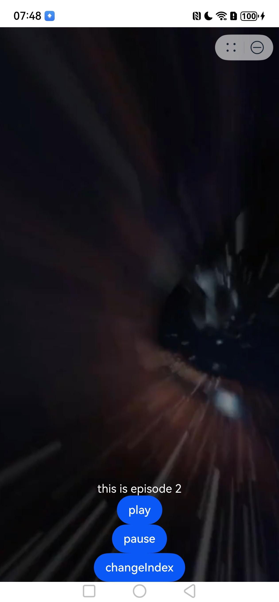

# 滑动视频组件快速入门

## 目录

- [简介](#简介)
- [使用](#使用)
- [API参考](#API参考)
- [示例代码](#示例代码)

## 简介

本组件提供了展示短剧滑动视频、上下滑动切换短剧视频、切换到指定索引短剧视频等相关的能力，可以帮助开发者快速集成滑动短剧视频相关的能力。


## 使用

1. 安装组件。 需要将模板根目录的components下**video_swiper**目录拷贝至您的工程相应目录。
   ```typescript
   // 在项目根目录build-profile.json5填写video_swiper路径
     "modules": [
       {
         "name": "video_swiper",
         "srcPath": "./video_swiper"
       }
     ]
   ```
   // 在项目根目录oh-package.json5填写video_swiper路径
   ```typescript
   "overrides": {
     "@agctemplate/video_swiper": "file:./video_swiper"
   }
   ```
   // 模块oh-package.json5填写video_swiper依赖
   ```typescript
   "dependencies": {
     "@agctemplate/video_swiper": "1.0.0"
   }
   ```

2. 引入组件。

   ```typescript
   import {
    VideoSwiper,
    PlayController
    } from '"@agctemplate/video_swiper';
   ```

3. 调用组件，详细参数配置说明参见[API参考](#API参考)。

   ```typescript
   import {
      PlayController,
      PlaySession,
      VideoPlayData,
      VideoPlayDataSource,
      VideoSwiper
   } from '@agctemplate/video_swiper';
   import { media } from '@kit.MediaKit';
   
   class EpisodeData implements VideoPlayData {
      url: string
   
      constructor(url: string) {
         this.url = url;
      }
   
      getUrl(): string | media.AVFileDescriptor {
         return this.url
      }
   
      getPlayTime(): number {
         return 0;
      }
   
      getPic(): string | ResourceStr {
         return '';
      }
   }
   
   @ComponentV2
   struct VideoDetail {
      build() {
         Stack({ alignContent: Alignment.Bottom }) {
            Text('Hello Video Swiper')
               .fontSize(40)
               .fontColor($r('sys.color.white'))
         }.height('100%')
   
      }
   }
   
   @Entry
   @Component
   struct Index {
      data: VideoPlayDataSource = new VideoPlayDataSource()
   
      aboutToAppear() {
         // 初始化数据
         let videoData1: EpisodeData =
            new EpisodeData('https://agc-storage-drcn.platform.dbankcloud.cn/v0/app-d45y3/drama_video/2.m3u8')
         let videoData2: EpisodeData =
            new EpisodeData('https://agc-storage-drcn.platform.dbankcloud.cn/v0/app-d45y3/drama_video/3.m3u8')
         this.data.pushData(videoData1);
         this.data.pushData(videoData2);
      }
   
      build() {
         Column() {
            // 视频切换组件
            VideoSwiper({
               videoPlayDataSource: this.data, // 视频数据
               contentBuilder: wrapBuilder(videoDetailComponent), // 自定义播放视频上的浮层界面
            })
         }
      }
   }
   
   @Builder
   function videoDetailComponent(videoData: VideoPlayData, playControl: PlayController,
      playerSession: PlaySession) {
   
      VideoDetail()
   }
   ```

4. 如需播放网络视频，需申请网络访问权限：ohos.permission.INTERNET

## API参考

### 接口

VideoSwiper(options: VideoSwiperOptions)

滑动视频组件。

**参数：**

| 参数名     | 类型                                            | 必填 | 说明         |
|---------|-----------------------------------------------|----|------------|
| options | [VideoSwiperOptions](#VideoSwiperOptions对象说明) | 是  | 配置滑动视频的参数。 |

### VideoSwiperOptions对象说明

| 名称                  | 类型                                                                              | 必填 | 说明             |
|---------------------|---------------------------------------------------------------------------------|----|----------------|
| videoPlayDataSource | [VideoPlayDataSource](#VideoPlayDataSource)                                     | 是  | 视频数据源          |
| playController      | [PlayController](#PlayController)                                               | 否  | 滑动播放控制器        |
| contentBuilder      | [WrappedBuilder<[VideoPlayData, PlayController, PlaySession]>](#WrappedBuilder) | 是  | 播放视频的上层自定义视图组件 |
| currentVideoIndex   | number                                                                          | 否  | 要播放的索引，默认0     |

### VideoPlayDataSource

滑动视频组件的视频数据源

#### totalCount

totalCount(): number

获取总长度

#### getgData

getData(index: number): VideoPlayData

获取索引数据

#### addData

addData(index: number, data: VideoPlayData): void

增加视频到指定索引

#### pushData

pushData(data: VideoPlayData): void

添加数据

### PlayController

VideoSwiper组件的控制器，用于播放控制，剧集选集等交互。

#### constructor

constructor()

PlayController的构造函数。

#### play

play()

播放视频

#### pause

pause()

停止播放视频

#### seek

seek(timeMs: number)

设置播放进度，单位ms（跳转到指定时间的前一个关键帧视频）

#### setSpeed

setSpeed(speed: media.PlaybackSpeed)

设置播放速度（单视频生效）

#### changeIndex

changeIndex(index: number)

播放指定索引视频

### WrappedBuilder

WrappedBuilder<[VideoPlayData, PlayController, PlaySession]>

滑动视频组件自定义播放上层视图接口， 用于开发者自定义显示内容，并和播放视频交互，例如播放控制、事件监听、剧集选集等。

### VideoPlayData

视频数据抽象接口，开发者在满足此接口定义情况下可以继承实现扩展

#### getUrl

getUrl(): string | media.AVFileDescriptor

获取播放资源，需开发者实现

#### getPlayTime

getPlayTime():number

获取当前播放进度，需开发者实现

#### getPic

getPic(): ResourceStr

获取封面图片用于视频加载时显示，需开发者实现

### PlaySession

单个播放视频的会话管理，封装avplayer实现单视频播控和事件监听

#### onStateChange

onStateChange(key: string, callback: (state: string) => void): void

状态变化事件监听，支持"stateChange"监听

#### onTimeUpdate

onTimeUpdate(key: string, callback: (time: number) => void): void

播放时间进度更新事件监听

## 示例代码

### 示例1（剧集播放页播放视频）

本示例通过video_swiper实现播放视频。

   ```typescript
   import {
      PlayController,
      PlaySession,
      VideoPlayData,
      VideoPlayDataSource,
      VideoSwiper
   } from '@agctemplate/video_swiper';
   import { media } from '@kit.MediaKit';
   
   class EpisodeData implements VideoPlayData {
      url: string
   
      constructor(url: string) {
         this.url = url;
      }
   
      getUrl(): string | media.AVFileDescriptor {
         return this.url
      }
   
      getPlayTime(): number {
         return 0;
      }
   
      getPic(): string | ResourceStr {
         return '';
      }
   }
   
   @ComponentV2
   struct VideoDetail {
      build() {
         Stack({ alignContent: Alignment.Bottom }) {
            Text('Hello Video Swiper')
               .fontSize(40)
               .fontColor($r('sys.color.white'))
         }.height('100%')
   
      }
   }
   
   @Entry
   @Component
   struct Index {
      data: VideoPlayDataSource = new VideoPlayDataSource()
   
      aboutToAppear() {
         // 初始化数据
         let videoData1: EpisodeData =
            new EpisodeData('https://agc-storage-drcn.platform.dbankcloud.cn/v0/app-d45y3/drama_video/2.m3u8')
         let videoData2: EpisodeData =
            new EpisodeData('https://agc-storage-drcn.platform.dbankcloud.cn/v0/app-d45y3/drama_video/3.m3u8')
         this.data.pushData(videoData1);
         this.data.pushData(videoData2);
      }
   
      build() {
         Column() {
            // 视频切换组件
            VideoSwiper({
               videoPlayDataSource: this.data, // 视频数据
               contentBuilder: wrapBuilder(videoDetailComponent), // 自定义播放视频上的浮层界面
            })
         }
      }
   }
   
   @Builder
   function videoDetailComponent(videoData: VideoPlayData, playControl: PlayController,
      playerSession: PlaySession) {
   
      VideoDetail()
   }
   ```


### 示例2（自定义组件使用，播放/暂停/更改播放剧集等）

   ```typescript
   import {
      PlayController,
      PlaySession,
      VideoPlayData,
      VideoPlayDataSource,
      VideoSwiper
   } from '@agctemplate/video_swiper';
   import { media } from '@kit.MediaKit';
   import { hilog } from '@kit.PerformanceAnalysisKit';
   
   class EpisodeData implements VideoPlayData {
      desc: string;
      url:string;
   
      constructor(url:string, desc: string) {
         this.desc = desc
         this.url = url
      }
   
      getUrl(): string | media.AVFileDescriptor {
         return this.url
      }
   
      getPlayTime(): number {
         return 0;
      }
   
      getPic(): string | ResourceStr {
         return '';
      }
   
      getDesc(): string {
         return this.desc
      }
   }
   
   let index: number = 0
   
   @ComponentV2
   struct VideoDetail {
      @Param @Require playSession: PlaySession
      @Param @Require playControl: PlayController
      @Param @Require episodeData: EpisodeData
   
      aboutToAppear(): void {
         this.playSession.onStateChange('stateChange', (state: string) => {
         // 进入详情播放页播放下一集
         if (state === 'completed') {
         hilog.info(0x000, 'VideoDetail', 'play complete, will play next')
         this.changeIndex()
      }
   })
   }
   
   build() {
      Stack({ alignContent: Alignment.Bottom }) {
         Column() {
            Text(this.episodeData.getDesc())
               .fontColor($r('sys.color.white'))
            Button('play')
               .onClick(() => {
                  this.playControl.play()
               })
            Button('pause')
               .onClick(() => {
                  this.playControl.pause()
               })
            Button('changeIndex')
               .onClick(() => {
                  this.changeIndex()
               })
         }
      }.height('100%')
   }
   
   changeIndex() {
      if (index === 0) {
         index = 1
      } else {
         index = 0
      }
      this.playControl.changeIndex(index)
   }
   }
   
   @Entry
   @Component
   struct Index {
      data: VideoPlayDataSource = new VideoPlayDataSource()
   
      aboutToAppear() {
         let videoData1: EpisodeData = new EpisodeData(
            'https://agc-storage-drcn.platform.dbankcloud.cn/v0/app-d45y3/drama_video/2.m3u8', 'this is episode 1')
         let videoData2: EpisodeData = new EpisodeData(
            'https://agc-storage-drcn.platform.dbankcloud.cn/v0/app-d45y3/drama_video/1.m3u8', 'this is episode 2')
         this.data.pushData(videoData1); // 初始化数据
         this.data.pushData(videoData2); // 初始化数据
      }
   
      build() {
         Column() {
            // 视频切换组件
            VideoSwiper({
               videoPlayDataSource: this.data, // 视频数据
               contentBuilder: wrapBuilder(videoDetailComponent), // 自定义播放视频上的浮层界面
            })
         }
      }
   }
   
   @Builder
   function videoDetailComponent(videoData: VideoPlayData, playControl: PlayController,
      playerSession: PlaySession) {
   
      VideoDetail({
         episodeData: videoData as EpisodeData,
         playControl: playControl,
         playSession: playerSession
      })
   }
   ```

| 第一集                                                         | 第二集                                                         |
|-------------------------------------------------------------|-------------------------------------------------------------|
|  |  |
